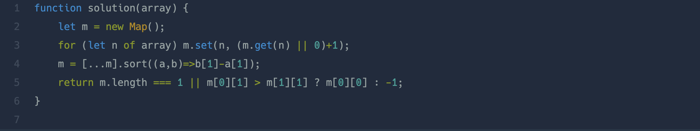

프로그래머스에서 문제를 풀다가 내 풀이보다 더 혁신적인 방법을 찾아서 파헤쳐보고자 한다!

## 참고한 풀이


프로그래머스에서 가장 상단에 나와있는 풀이 방법이다.  
나는 거의 30줄에 걸쳐 문제를 해결했는데 이 분들은 4줄만에 해결했다..!!! 🥲

## Map Object (맵 객체)

ES6 문법이고 값을 카와 값으로 묶어 저장하고 조회하는 기능이 있다.

```javascript
let map1 = new Map();
// set으로 맵 객체에 삽입
map.set('이름','김올림');
map.set('전공','컴퓨터공학');

// 이차원 배열로 넘겨줌
let map2 = new Map([
    ['이름','김올림'];
    ['전공','컴퓨터공학'];
])

// get으로 맵 객체 조회
map1.get('이름'); // 김올림

// delete로 삭제
map1.get('전공'); // 삭제가 성공하면 true 반환

// clear로 맵 안의 프로퍼티 전부삭제
map1.clear();
```

맵 객체는 문자열이 아닌 값도 키로 사용 가능하다.

```javascript
const errorMessageObj = {
  404 : "페이지가 없습니다",
  500 : "서버 오류입니다",
}
​
const errorMessageMap = new Map([
  [404, "페이지가 없습니다"],
  [500, "서버 오류입니다"],
])
​
errorMessageObj.404 // unexpected number 에러
errorMessageObj["404"] // '페이지가 없습니다'
errorMessageMap.get(404) // '페이지가 없습니다'
```

## 풀이 파헤쳐보기!

```javascript
let m = new Map()
```

맵 객체 생성하기

```javascript
for (let n of array) m.set(n, (m.get(n) || 0) + 1)
```

array를 순회하면서 set으로 m에 삽입한다.  
key에는 해당 숫자를 넣고 value에는 숫자의 갯수를 집어넣는다. 이때 똑같은 숫자가 없으면 1이고 똑같은 숫자가 있다면 원래값+1이 들어가게 된다.

```javascript
m = [...m].sort((a, b) => b[1] - a[1])
```

value값을 기준으로 큰 숫자부터 정렬한다. 즉 빈도수가 높은 숫자부터 정렬하는 것을 의미한다.

```javascript
return m.length === 1 || m[0][1] > m[1][1] ? m[0][0] : -1
```

m의 길이가 1이라면 m[0][0]을 반환하고, 길이가 1이 아니라면 먼저 빈도수대로 정렬한 m의 첫번째값의 빈도수와 두번째값의 빈도수를 비교한뒤 첫번째값의 빈도수가 크다면 m[0][0]을 반환하고 그렇지않다면 -1을 반환한다. 첫번째값의 빈도수와 두번째값의 빈도수를 비교하는 이유는 m을 이미 정렬한 상태이기 때문에 첫번째값의 빈도수가 크다면 같은 빈도수를 가진 값이 없다는 것을 뜻하기 때문이다.
