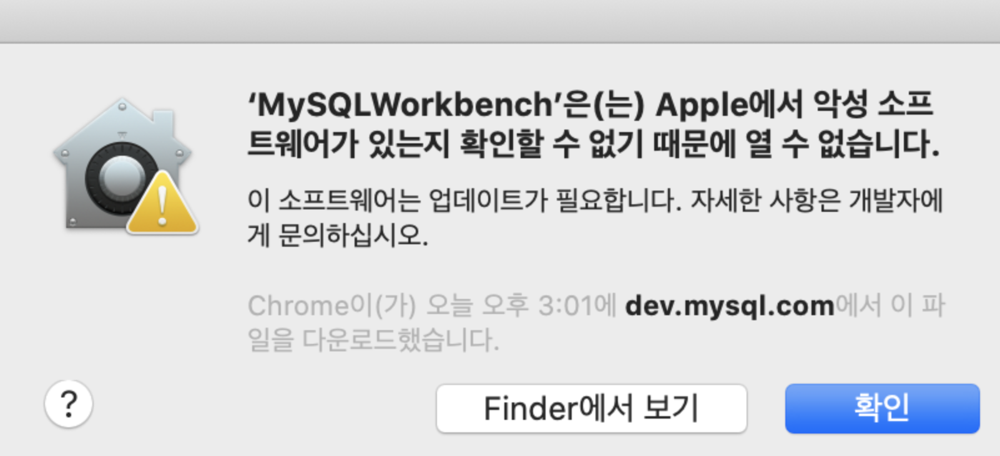
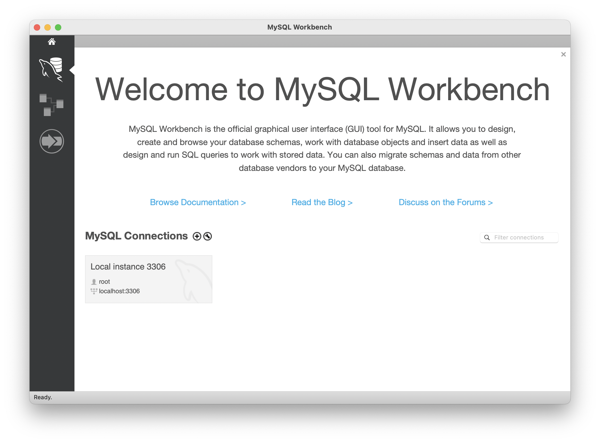

어제 오늘 맥북에 MySQL Workbench를 설치하느라 꽤 애를 먹었다. 아니 아무리 해도 설치가 안되길래 정말 이것저것 찾아보았는데도 설치 후 파일이 안열렸다.. 😡 
그러다가 결국 해결책을 찾게 되었는데.... 그냥 버전 문제였다 🤬  
이렇게 뻘짓할 시간을 줄이기 위해 해결방법을 공유하고자 글을 작성하게 되었다.

## MYSQL Workbench 다운로드 받기
https://downloads.mysql.com/archives/workbench/  
위의 링크에서 다운로드를 받아야 파일이 열린다. 안그러면 'MYSQLWorkbench 응용 프로그램이 예기치 않게 종료되었습니다'라는 창만 주구장창 보게 될 것이다 ^^

## 설치 후 에러가 발생할 때
   
workbench를 설치 후 처음 파일을 열면 이런 에러 창이 뜰 것이다. 
당황하지 말고  `시스템 환경 설정 - 보안 및 개인 정보 보호 - 일반 - 다음에서 다운로드한 앱 허용` 부분에서 `확인 없이 열기` 버튼을 누르면 된다.  
해결 방법은 https://seyul.tistory.com/78 에서 참고하였다. 감사합니다(꾸벅)

## 실행 화면
   
드디어 나온다!!

## 마무리
지금까지 공부 관련한 것만 포스팅 했지만, 이런 상황들을 해결했을 때의 방법들을 정리하고자 이렇게 글을 쓰게 되었다.
workbench 때문에 골머리났을 누군가에게 도움이 되길 바라며 이만 글을 마치겠다.

