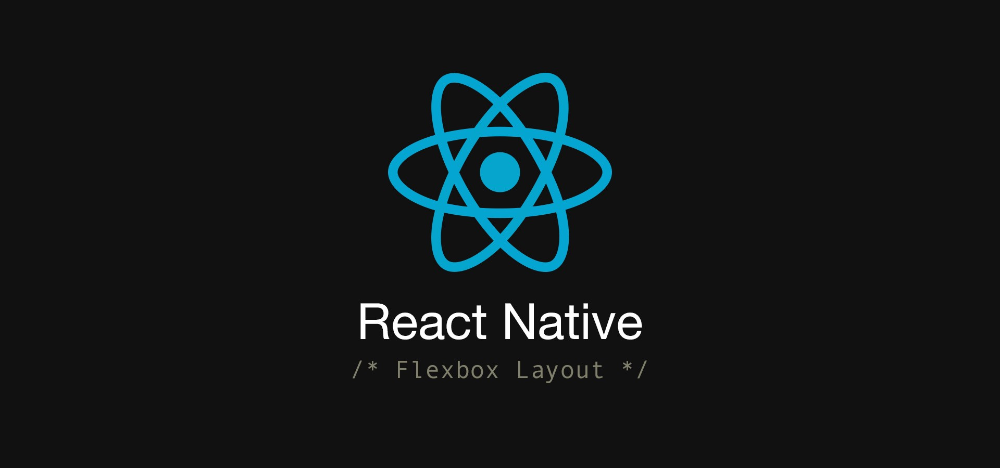

## Flex

각 요소의`flex 속성`에 따라 공간이 나뉜다.  
예를 들어 빨간 영역이 
`flex:1`, 노란 영역이 `flex:2`, 녹색 영역이 `flex:3`이라면 1+2+3+=6, 
빨간 영역이 1/6공간, 노란 영역이 2/6공간, 녹색 영역이 3/6 공간을 차지하게 된다.

## FlexDirection

flexDirection은 방향을 제어한다.  
`row` : 왼쪽으로 오른쪽으로 정렬, `column ` : 기본값, 위에서 아래로 정렬, `row-reverse` : 오른쪽에서 왼쪽으로 정렬, `column-reverse ` : 아래서 위로 정렬

## JustifyContent

justifyContent는 기본 축 내에서 자식을 정렬하는 방법이다. flexDirection을 중심으로 이 속성을 사용한다.  
`flex-start`: 기본값, 컨테이너의 기본 축의 시작 부분에 맞춤, 
`flex-end`: 기본 축 끝에 정렬, `center`: 중앙에 정렬, `space-between`균등한 간격을 두고 나머지 공간에 분배, 
`space-around`: space-between과 비슷하지만 끝의 공간의 간격도 생김.

## AlignItems

alignItems는 항목 정렬이라는 것에서 justifyContent와 비슷하지만 주축이 아닌 교차 측에 적용된다.  
`stretch`: 기본, height 컨테이너의 교차 축과 일치하도록 늘림, `flex-start`: 교차 축 시작 부분에 맞춤,
`flex-end`: 교차 축 끝에 정렬, `center`: 교차 축 중심에 맞춤.
```javascript
import React from 'react';
import { View } from 'react-native';

const AlignItemsBasics = () => {
    return (
      <View style={{
        flex: 1,
        flexDirection: 'column',
        justifyContent: 'center',
        alignItems: 'stretch',
      }}>
        <View style={{width: 50, height: 50, backgroundColor: 'powderblue'}} />
        <View style={{height: 50, backgroundColor: 'skyblue'}} />
        <View style={{height: 100, backgroundColor: 'steelblue'}} />
      </View>
    );
};

export default AlignItemsBasics;
```

## 마무리

지금까지 flexbox를 사용한 레이아웃에 대해 알아보았다. 더 많은 속성은 공식 문서에서 확인할 수 있다.  
https://reactnative.dev/docs/flexbox  
